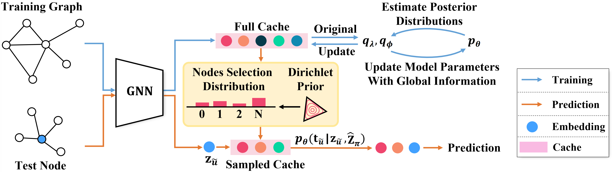

## CacheGNN: Enhancing Graph Neural Networks with Global Information Caching

This repository contains the PyTorch implementation for our CacheGNN. Further details about CacheGNN can be found in our paper.

## Abstract

Graph neural networks (GNNs) have achieved impressive results on various graph learning tasks. Most GNNs merely leverage information from a limited range of local neighbors, which is difficult to effectively capture global information in the graph. However, utilising global information enables GNNs to capture long-range dependencies and learn more informative node representations. To this end, we propose CacheGNN, an approach that leverages information from global similar nodes to enhance GNNs. Our CacheGNN uses a cache to store node representations and utilises those cached embeddings to efficiently find global similar nodes. To quickly and efficiently making predictions at test time, our CacheGNN retrieves global similar nodes from a set of representative nodes, which is selected from a sparse node selection distribution with Dirichlet prior. We conduct node classification experiments on seven real-world datasets under inductive and transductive settings. Experimental results verify the effectiveness of our CacheGNN.

## Model Framework Overview

<p align="center">
  
</p>

## Requirements

- Python 3.6

- PyTorch 1.10.1
- Scikit-Learn 1.12
- Scipy 1.5.2
- PyTorch_Geometric 2.1.0

## Implement Details

CacheGNN can be equipped with various GNN models, now CacheGNN supports the following GNN models:

- GCN
- SGC
- GraphSAGE
- GCNII
- GAT
- GATv2Conv

In the future, we aim at enabling CacheGNN to support more GNN models.

## Data Download

Please first download the dataset and unzip it into `data` directory.

Google Drive Link: https://drive.google.com/file/d/1Js_RMDL82sU-kj2AIa9Lvn4lFWUaQb9K/view?usp=sharing

## CacheGNN Training 

```python
python train.py --cuda_id 0 --model [graphsage/gat/gcn/sgc/gcnii/gat2conv] --hidden_dim 64 --eta 1 --log_dir ./log/graphsage_dblp --k 3 --epochs 50 --dataset ppi --lr 1e-5
```

## CacheGNN Prediction

```python
python predict.py --cuda_id 0 --model_path your_trained_cachegnn_path
```

